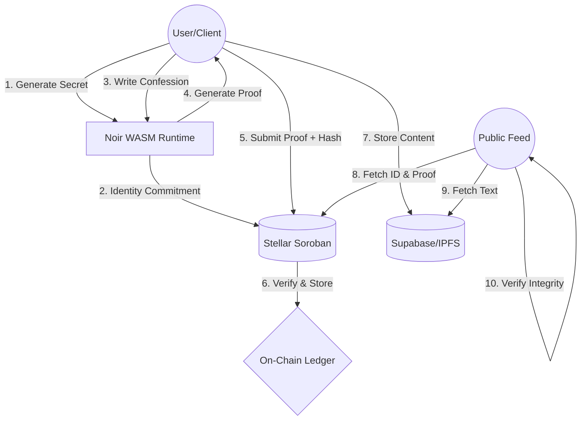

# 🚀 ZKonfess
### "Cryptography, not trust. Immutable anonymity on the Stellar Network."

[](https://stellar.org)
[](https://noir-lang.org/)
[](LICENSE)

---

## 📌 Problem Statement
In the digital age, "anonymous" platforms are often a facade. Centralized servers log IP addresses, metadata, and timestamps. Whether it is corporate whistleblowing, sensitive community feedback, or personal catharsis, users face a fundamental risk: **retaliation via de-anonymization.** 

Current solutions require you to trust a service provider's "privacy policy." We believe privacy should be a **mathematical guarantee**, not a promise.

## 💡 Solution: ZKonfess
**ZKonfess** is a decentralized, zero-knowledge application (zkApp) built on the **Stellar (Soroban)** smart contract platform. It allows users to post immutable confessions that are cryptographically proven to be authentic without ever revealing the author’s identity to the network, the admins, or the public.

By decoupling identity from authorship using **Zero-Knowledge Proofs (ZKP)**, we provide a "Digital Dossier" that is tamper-proof, censorship-resistant, and mathematically private.

## 🧠 Key Features
- **Zero-Knowledge Anonymity:** Verify you are a registered user without revealing your wallet address.
- **On-Chain Immutability:** Once a confession is proven valid by the Soroban contract, it exists forever on the Stellar ledger.
- **Truth-Market Gamification:** A unique betting mechanism where the community uses XLM to stake on the authenticity (Real vs. Fake) of an entry.
- **Cryptographic Reveal:** Authors can choose to "unmask" themselves by proving possession of the original secret without leaking it to others until they choose to.
- **Engagement Layer:** Anonymous voting (Relatable, Shocking, Fake) and comment threading.

## 🏗 Architecture / How It Works
The platform operates on a three-tier cryptographic stack:



1.  **Identity Layer (Noir):** Users generate an ephemeral "Identity Secret" locally. A hash of this secret (Commitment) is stored on-chain.
2.  **Proof Generation:** When submitting, the browser generates a ZK-proof (Groth16/Plonk) proving:
    *   The user knows a secret corresponding to a registered commitment.
    *   The user has not already used a unique "Nullifier" for this specific entry.
3.  **Validation Layer (Soroban):** The smart contract verifies the ZK-proof. If valid, the transaction is executed, and the confession is minted.

## ⚙ Tech Stack
- **Smart Contracts:** Soroban (Rust-based)
- **ZK-Logic:** Noir (the domain-specific language for Zero-Knowledge Circuits)
- **Blockchain:** Stellar Testnet
- **Frontend:** React + TypeScript + Vite
- **Wallet Integration:** Freighter SDK
- **Styling:** Custom CSS (Vault/Dossier aesthetic)

## 📊 Use Cases
- **Corporate Transparency:** Employees reporting unethical behavior without HR tracking.
- **Mental Health:** Sharing personal struggles in a space where "no-one knows who you are" is a hardware guarantee.
- **Community Governance:** Unbiased feedback loops for DAOs or local organizations.

## 🔮 Roadmap
### Phase 1: MVP (Current)
- [x] Basic ZK-Proof bypass for simulation.
- [x] Soroban contract deployment & Wallet integration.
- [x] Voting and Betting infrastructure.
- [x] Local content persistence.

### Phase 2: Decentralized Storage
- [ ] Integration with IPFS/Filecoin for encrypted content storage.
- [ ] On-chain Noir verification optimization.
- [ ] Mobile-responsive PWA.

### Phase 3: The Truth DAO
- [ ] $TRUTH tokenomics: Incentivizing honest confessions.
- [ ] Peer-to-peer dispute resolution for betting markets.
- [ ] Encrypted private messaging between users (Zero-Knowledge).

## 🛠 Installation Steps
1.  **Clone the Repository:**
    ```bash
    git clone https://github.com/ShivamSoni20/Steller.git
    cd Steller
    ```
2.  **Install Dependencies:**
    ```bash
    bun install
    ```
3.  **Environment Setup:**
    Configure `.env` with your Stellar Testnet credentials and Contract IDs.
4.  **Launch Dev Server:**
    ```bash
    cd zk-confession-box-frontend
    bun run dev
    ```

## 📈 Vision
We are building more than a message board; we are building a protocol for **Verifiable Anonymity.** In a future where data is the most valuable commodity, we provide the tools for users to reclaim their story without surrendering their identity. We aim to become the standard for anonymous data integrity in the Web3 ecosystem.

## 🤝 Contributing
Contributions are welcome. Please refer to our `CONTRIBUTING.md` for standards regarding Noir circuits and Soroban contract optimizations.

## 📜 License
This project is licensed under the MIT License - see the [LICENSE](LICENSE) file for details.

---
**Build with ❤️ for the Stellar Meridian Ecosystem hackathon.**
